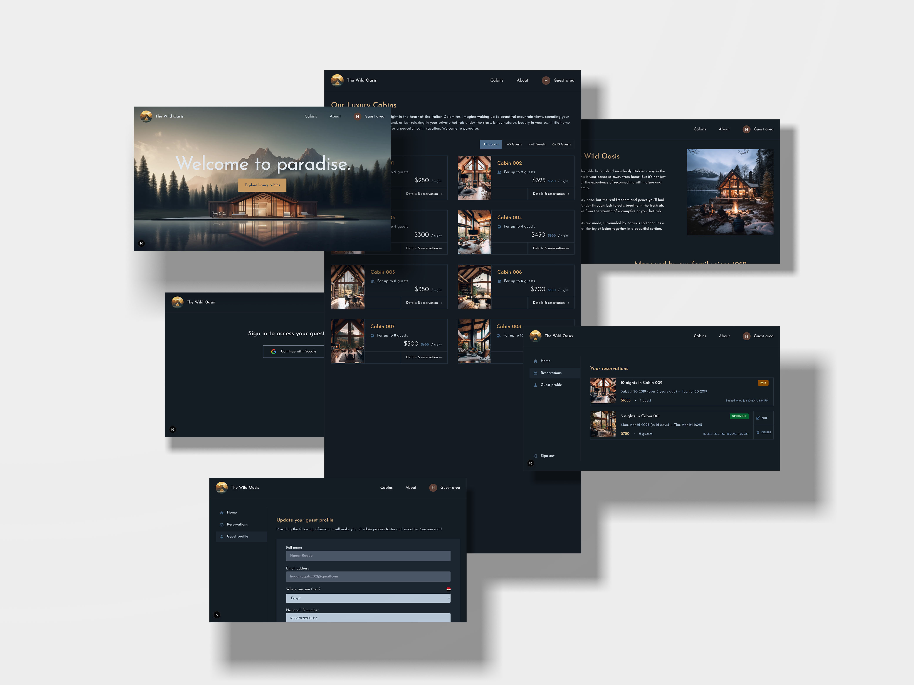

# **The wild oasis website**

## **Table of content:**

- [Description](#description)
- [Key Features](#key-features)
- [Project Structure](#project-structure)
- [Technical Highlights](#technical-highlights)
- [Getting Started](#getting-started)

**Live demo** [click here]()



---

### **Description:**

The World Wise is a luxurious business website showcasing eight exclusive cabins nestled in the heart of the Italian Dolomites. It provides guests with detailed information about the accommodations, company background, and an easy-to-use booking system.

---

### **Key Features:**

- **Single Page Application (SPA):** Built with Next.js for fast and seamless navigation.
- **Multiple Routes:**
  - Home: Overview of The World Wise experience.
  - Cabins: Detailed descriptions of each of the 8 luxury cabins.
  - About: Information about the company and its vision.
  - Guest Area: Users can log in, view past and upcoming reservations, and make new bookings.
- **Cabin Reservation System:**
  - Select start and end dates.
  - Specify the number of guests.
  - Add special requests or observations.
- **User Authentication:**
  - Login via Google authentication powered by Auth.js.
- **Database & Backend:**
  - Managed with Supabase for real-time data storage and retrieval.

---

### **Project Structure:**

```
- app
  - about
    - page.js
  - account
    - layout.js
    - loading.js
    - page.js
    - profile
      - page.js
    - reservations
      - edit
        - [bookingId]
          - page.js
      - page.js
  - api
    - auth
      - [...nextauth]
        - route.js
    - cabins
      - [cabinid]
        - route.js
  - cabins
    - loading.js
    - not-found.js
    - page.js
    - thankYou
      - page.js
    - [cabinid]
      - page.js
  - error.js
  - icon.png
  - layout.js
  - loading.js
  - login
    - page.js
  - not-found.js
  - page.js
  - _components
    - Cabin.js
    - CabinCard.js
    - CabinList.js
    - DateSelector.js
    - DeleteReservation.js
    - Filter.js
    - FilterButton.js
    - Header.js
    - LoginMessage.js
    - Logo.js
    - Navigation.js
    - Reservation.js
    - ReservationCard.js
    - ReservationContext.js
    - ReservationForm.js
    - ReservationReminder.js
    - ReservationsList.js
    - SelectCountry.js
    - SideNavigation.js
    - SignInButton.js
    - SignOutButton.js
    - Spinner.js
    - SpinnerMini.js
    - SubmitButton.js
    - TextExpander.js
    - UpdateProfileForm.js
  - _lib
    - actions.js
    - auth.js
    - data-service.js
    - supabase.js
  - _styles
    - globals.css
- middleware.js
- public
- README.md
```

---

### **Technologies Used:**

- **Frontend:** Next.js (React-based framework)
- **Backend & Database:** Supabase
- **Authentication:** Auth.js (Google provider)

### **Getting Started:**

#### Prerequisites

- Node.js installed
- Supabase account and project setup
- Google authentication credentials for Auth.js

#### Installation

1. Clone the repository:
   ```sh
   git clone https://github.com/yourusername/the-world-wise.git
   cd the-world-wise
   ```
2. Install dependencies:
   ```sh
   npm install
   ```
3. Create an `.env.local` file and configure environment variables
4. Run the development server:
   ```sh
   npm run dev
   ```
5. Open [http://localhost:3000](http://localhost:3000) in your browser.
